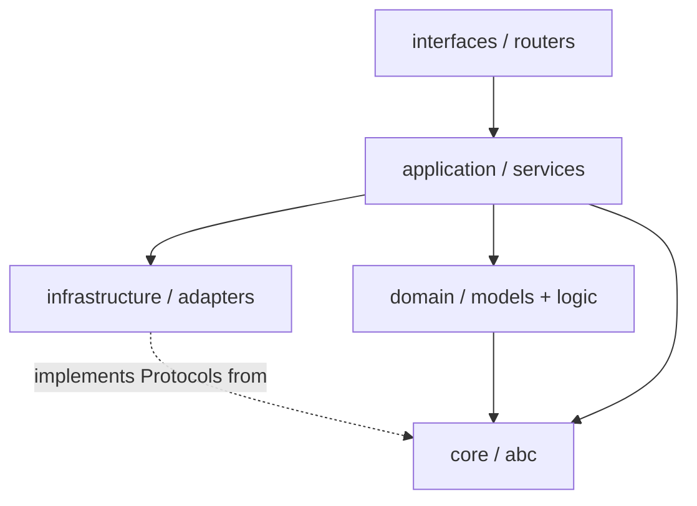

# Clean Architecture (Python)

## Purpose

This skill applies the language-agnostic Clean Architecture and layering rules from `software-engineering-principles` and `backend-engineering` to Python packages. It defines the canonical project structure, the import-direction rule, Protocol-based dependency inversion, and how to choose value-object types. It does not restate SOLID/DRY — see the core skill for those.

## When to Trigger

- Loaded as a domain skill when the project tech stack includes Python.
- Triggered when creating a new Python package, defining module boundaries, wiring dependencies, or reviewing cross-layer imports.

---

## 1. Canonical Package Structure

```
my_project/
├── pyproject.toml
├── README.md
└── src/my_project/
    ├── __init__.py
    ├── __main__.py           # Composition root — the ONLY place wiring happens
    ├── core/                 # Foundational types, no dependency on other app modules
    │   ├── abc.py            # Enums, Protocols, abstract base classes
    │   ├── context.py        # Application context (frozen dataclass of runtime config)
    │   └── exceptions.py     # Custom exception hierarchy
    ├── domain/               # Pure business logic + models (framework-agnostic)
    ├── application/          # Use-case orchestration (services)
    ├── infrastructure/       # Adapters: DB, HTTP clients, logging setup
    └── interfaces/           # Entry surfaces: CLI, HTTP routers
```

Initialise as a package (`uv init --package`) and run as a module (`python -m my_project`). `__main__.py` is the sole entry point.

---

## 2. The Import-Direction Rule

**Dependencies point inward. Imports flow downward only; no layer imports from a layer above it.**



| Layer | May import | Must NOT |
|-------|-----------|----------|
| `interfaces` | application, core | domain internals, infrastructure concretions |
| `application` | domain, core, Protocols | framework types, raw SQL, HTTP libs |
| `domain` | core only | anything I/O, frameworks |
| `infrastructure` | core, Protocols it implements | application/domain business logic |
| `core` | stdlib only | any other app module |

- **Business logic must not depend on frameworks.** The `application`/`domain` layers are import-clean of FastAPI, psycopg, etc.
- **Repositories are the only place raw SQL / ORM sessions live** (see `postgresql`). Services depend on repository **Protocols**, not concrete repositories.
- **The service layer raises domain exceptions** (e.g. `RecordNotFound`), never framework exceptions like `HTTPException`. Adapters translate domain exceptions to transport errors (see `fastapi`, `backend-engineering` RFC 9457).

---

## 3. Composition Root

- `__main__.py` is the **only** composition root: it loads configuration, reads secrets via an injected provider, constructs concrete adapters, and wires them into services.
- Global state and singletons are discouraged outside the composition root. Any unavoidable global is justified, documented, and isolated.
- **Secrets** are retrieved via an injected provider exposing `get(name: str) -> str`; no component outside the entry point reads environment variables or secret stores directly (see `security-principles` §3).

---

## 4. Dependency Inversion with Protocols

Inject `Protocol` abstractions into constructors; never construct dependencies inside business logic.

```python
from typing import Protocol, runtime_checkable

@runtime_checkable
class SessionRepository(Protocol):
    async def get_by_id(self, session_id: str) -> "Session | None": ...

class SessionService:
    def __init__(self, repo: SessionRepository) -> None:
        self._repo = repo  # concrete implementation injected at the composition root
```

This keeps the service testable with an in-memory fake (see `pytest-testing`) and swappable per Liskov (see `software-engineering-principles`).

---

## 5. Type Selection Guide

| Use case | Type | Notes |
|----------|------|-------|
| Internal immutable value object / state | **frozen dataclass** | `@dataclass(frozen=True, slots=True)`; validate in `__post_init__` |
| External data (JSON payloads, dict-like) | **TypedDict** | Structural, no runtime validation |
| Simple multi-value return | **NamedTuple** | Named fields, immutable, no validation |
| External API contract / (de)serialization | **Pydantic** | Request/response models (see `fastapi`) |
| Constrained value set / state machine | **StrEnum / Enum** | `Environment`, `LogLevel`, `Status` |

- Prefer **immutability by default**.
- Refactor long parameter lists / primitive obsession into value objects. Prefer ≤ 2 arguments; pass a value object beyond that.

---

## 6. Rejected Anti-Patterns

- God objects; hidden singletons; implicit global state.
- Business logic in CLI, routers, or infrastructure layers.
- Repositories returning live ORM sessions or DB row objects instead of domain models / frozen value objects.
- Services importing or raising framework HTTP exceptions.
- Constructing concrete adapters (DB, HTTP client) inside a service instead of injecting them.

---

## References

- Clean Architecture (Robert C. Martin) — dependency rule.
- `typing.Protocol` (PEP 544 — structural subtyping): <https://peps.python.org/pep-0544/>.
- `dataclasses`: <https://docs.python.org/3/library/dataclasses.html> · `enum.StrEnum`: <https://docs.python.org/3/library/enum.html#enum.StrEnum>.
- Hexagonal Architecture (Alistair Cockburn): <https://alistair.cockburn.us/hexagonal-architecture/>.
