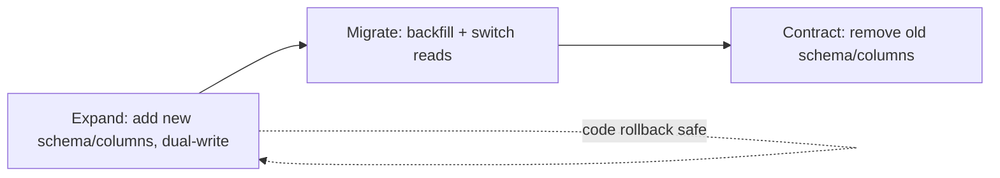

# Reliability and Scalability

## Purpose

**Failure is expected behaviour.** This skill defines how services stay reliable when their dependencies fail: fault-tolerance patterns, graceful degradation, backpressure, safe deployment, and capacity planning. It is language-agnostic and pairs with `backend-engineering` (error contracts, timeouts, idempotency at the API layer) and `observability` (SLIs/SLOs, alerting).

## When to Trigger

- Loaded by **Software Engineer**, **Code Architect**, and **DevOps Specialist**.
- Triggered for any change involving cross-service calls, queue interactions, database queries, retries, fallbacks, or deployment/migration.

---

## 1. The Default Posture for Every Dependency

For every cross-service call, database query, and queue interaction:

1. **Assume it will fail.**
2. **Decide what "fail" means for the user** — hard error? degraded mode? cached result? retry later?
3. **Make that choice explicit in code and documentation.** "What does this system do when X is down?" must have a written answer.

We do **not** catch and ignore. We do **not** silently substitute fallbacks. We do **not** return wrong data and pretend it's right. We surface failures honestly, in the way that protects the user best. (See `silent-failure`.)

---

## 2. Fault-Tolerance Patterns

| Pattern | Rule |
|---------|------|
| **Timeouts** | Every outbound call has an explicit timeout **shorter than the caller's deadline**. Default-to-infinity timeouts are bugs. |
| **Retries** | Exponential backoff **with full jitter**, for **idempotent operations only**. Cap total attempts *and* total elapsed time. |
| **Circuit breakers** | Around remote dependencies; open on sustained error rate; trickle traffic in half-open state. |
| **Bulkheads** | Separate thread/connection pools per downstream so one slow dependency cannot starve unrelated paths. |
| **Idempotency keys** | On every state-changing API so retries are safe. |
| **Graceful degradation** | A feature that depends on a non-critical service fails to a sensible default rather than a 500. |
| **Queues absorb bursts** | Prefer event-driven over synchronous fan-out across many services. |

---

## 3. Graceful Degradation

When a non-critical dependency fails, the user-facing path continues with reduced functionality:

- Recommendation widget down → render the page without it.
- Image CDN slow → serve a placeholder, lazy-load when possible.
- Analytics service down → store events locally, retry on a background loop.
- Personalization service down → serve the generic experience.

**Degradation is logged and metricized** so we know it happened. Silent degradation is its own outage.

---

## 4. Retry Policies

- **Retries are for transient failures only.** Authentication errors, validation failures, and "not found" are **not** retried.
- **Only idempotent operations are retried.** A non-idempotent write requires an idempotency key before it is safe to retry.
- **Exponential backoff with full jitter.** Synchronized retries are how we DDoS our own recovering service.
- **Bounded retries** — a maximum number of attempts *and* a maximum total elapsed time.
- **The caller's deadline wins.** A retry that would exceed the caller's deadline is skipped.
- **Retry storms are watched** — sudden retry-rate spikes alert before they break the upstream.

---

## 5. Backpressure and Load Shedding

When a system is overloaded, it must **shed load rather than collapse**.

- **Bounded concurrency** in every worker: limited DB connections, limited HTTP client pool, limited queue concurrency.
- **Queue-depth alarms** before the queue saturates.
- **Adaptive throttling** at API gateways for non-critical clients during partial outages.
- **Priority classes** — if billing-critical processing and ad-hoc exports share a worker pool, billing wins under load.
- **Drop with grace** — when shedding, return clear errors with `Retry-After` so clients back off rather than amplify.

---

## 6. Idempotency

Retry-safety is the cheapest tool for failure recovery.

- Every state-changing API accepts an `Idempotency-Key`; duplicate keys return the original result.
- Event consumers deduplicate by event ID.
- Idempotency is tested with **deliberate duplicate-delivery tests**.

---

## 7. Deployment Safety

- **Every deploy is reversible within 5 minutes.**
- **Canary deployments** for user-visible changes, with automated rollback on SLO breach.
- **Database migrations are decoupled from code deploys** — expand → migrate → contract. A code rollback never requires a database rollback.
- **Deploy markers in dashboards** make regression-vs-deploy correlation obvious.
- **Pre-deploy snapshot, post-deploy compare** is automated; alarms fire on deviation.

---

## 8. Game Days

- **Quarterly game days** per team, drawn from a scenario library: AZ failure, dependency timeout, DLQ flood, certificate expiry, region failover.
- **Findings produce action items** with owners and dates.
- New scenarios are added based on real incidents and emerging risks.
- **Runbooks are tested** during game days. A runbook that fails the game day fails before the real incident.

---

## 9. SLIs, SLOs, and Reliability Investment

- Every user-facing service defines SLIs (availability, latency, correctness) in product terms. SLOs are written, agreed with product, and visible on a public dashboard. Typical targets: 99.9% availability, p99 < 500 ms for synchronous paths. (Detail in `observability`.)
- **Error budgets gate risk** — burning budget faster than allowed pauses non-urgent deploys.
- **100% targets are anti-patterns** — they encourage hiding failures.
- Every team commits **≥ 15% of capacity per quarter** to reliability and platform investment (reducing pager noise, closing recurring incident causes, tightening retry/timeout/idempotency on hot paths).

---

## 10. Capacity Planning

- **Benchmark before scaling** — load test with realistic traffic shapes (distribution and concurrency, not just RPS).
- **Autoscale on a metric that correlates with load** (queue depth, in-flight requests), not just CPU on a memory-bound service.
- **Capacity reviews** each quarter for top services, plus before any known traffic event.

---

## 11. Anti-Patterns We Explicitly Reject

- "Just retry harder" — pummeling a struggling dependency without backoff.
- Silent fallbacks that hide that a system is degraded.
- Single points of failure in production paths.
- Dependency chains four or five services deep on the request path without an RFC.
- "It hasn't failed yet" as a substitute for thinking through what happens when it does.
- DR plans that have never been rehearsed.
- Treating reliability work as optional or a luxury for quiet quarters.

---

## References

- Company Reliability and Scalability standard (source of truth for this skill).
- Google SRE Book — *Handling Overload*, *Addressing Cascading Failures*: <https://sre.google/sre-book/handling-overload/>.
- AWS Builders' Library — *Timeouts, retries, and backoff with jitter*: <https://aws.amazon.com/builders-library/timeouts-retries-and-backoff-with-jitter/>.
- Release It! (Michael Nygard) — circuit breaker, bulkhead patterns.
