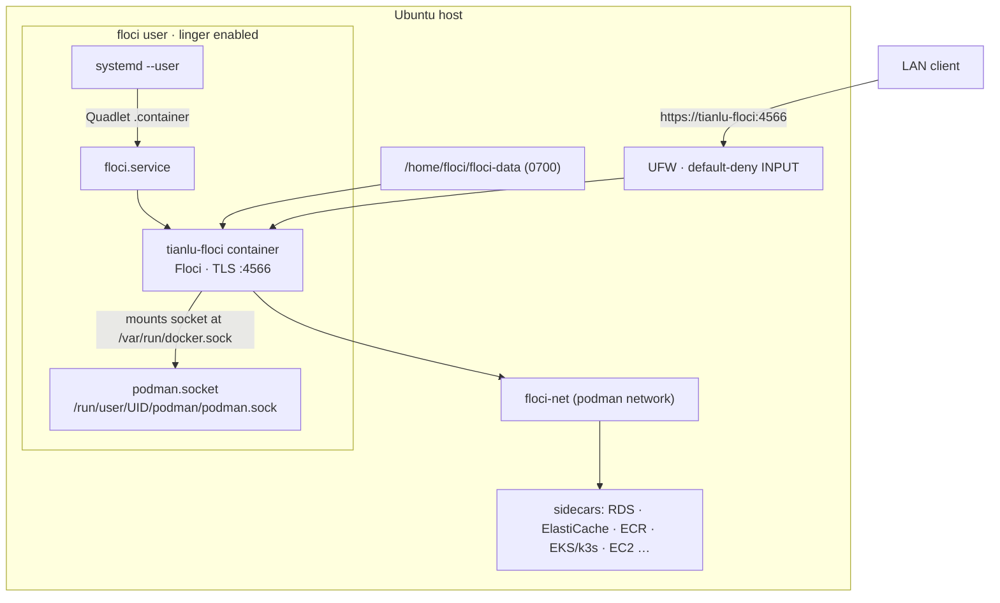

# Tianlu: Floci on Ubuntu Server with rootless Podman

Tianlu is an idempotent bash installer (`setup-floci.sh`) that puts
[Floci](https://floci.io), a local self-hosted AWS emulator, onto an Ubuntu
server and runs it under rootless Podman.

It pins the image `docker.io/floci/floci:1.5.33-compat`. The *compat* build ships
Python 3, the AWS CLI, and boto3 inside the container, so it can run
initialization hooks and client tooling without me installing anything extra.

> There's no application code in here, just the installer and the design docs
> behind it. Floci itself is the container image.

## Raison d'être

I just started my journey into AWS and wanted a **local sandbox** to learn and experiment without incurring costs or risking my real AWS account. My other two options were to request a sandbox account from my employer or to use my own AWS account, but both have drawbacks: the former is slow and bureaucratic, and the latter is risky and expensive. 

While debating my options, the divine power of cookies and digital surveillance led me to discover Floci while scrolling on Instagram, and here I am, co-writing this README with a bunch of AI agents.

As a start I wanted to install Floci on my own Ubuntu server, so I started with the setup-floci.sh script, then started writing the end-to-end tests, so it occurred to me that if I could run a full qemu VM on my mac for testing with systemd and quadlets, why not make that environment available for local development too? So I did.

## Why two weeks for a two-minute install

You can get Floci running in two minutes with a single command. I've spent two
weeks on it. Not because I want to over-engineer a perishable dev environment,
but because I appreciate good design, and I'd rather not leave the most important
decisions for later just to start quickly. I wanted to see what a real
production-grade setup looks like, or at least get a taste of it.

## Why rootless Podman

Floci runs as its own unprivileged `floci` user. So if someone breaks into the
Floci container, or into one of the sidecars it spawns, the worst they get is
that one user's namespace. There's no road from there to root on the host, which
is the whole point. The longer version is in
[`docs/design/solution-design.md`](docs/design/solution-design.md) §2.

## How it fits together



- The container runs as a systemd user service, described by a Quadlet
  `.container` file at `~/.config/containers/systemd/floci.container`. Lingering
  (`loginctl enable-linger`) keeps it alive across logouts and reboots.
- It mounts the rootless Podman socket, which is how Floci spawns its sidecar
  containers (RDS, ElastiCache, ECR, EKS/k3s, EC2, and friends) through Podman's
  Docker-compatible API.
- All those sidecars sit on one named network, `floci-net`, so they get real
  container DNS and reachable IPs. The rootless default bridge reliably gives you
  neither, which is why I don't lean on it.
- TLS is Floci's own self-signed certificate. Storage lives under
  `/home/floci/floci-data` and sticks around.

The full design is in [`docs/design/solution-design.md`](docs/design/solution-design.md).

### Architecture notes

Don't be intimidated by quadlets, systemd, and rootless Podman. If you don't know what they are, it's completely fine. 
I knew very little about them when I started this project, and I started to learn about them from my lovely AI agents. They are really cool and powerful, and I think they are worth learning about. But if you just want to run Floci, you can ignore them and just run the `setup-floci.sh` script.

## Getting started

To try it on your Mac, type `make dev-up` and you're there! It'll print hints in
the terminal on where to go next. That path spins up a small Ubuntu VM and runs
everything inside it, so your Mac stays clean (there's more under
[Persistent local dev environment](#persistent-local-dev-environment)).

To install it on your own server, you'll want `setup-floci.sh` (see
[Usage](#usage) below). Give it a go, and if it doesn't run, tell me.

On Windows? Get a Mac, or a Linux box. On Linux I tried hard to keep the scripts
portable, but if you hit a snag, help me fix it instead of heading to LinkedIn to
bash me with angry comments. :D

## Prerequisites

- Ubuntu 24.04 or newer (I run it on 26.04 LTS), x86_64.
- Root or `sudo` for the setup phase: it makes a user, installs packages, and touches the firewall.

## Usage

```bash
# Non-interactive; opens the firewall to the server's auto-detected LAN /24
sudo ./setup-floci.sh

# Pause at each phase boundary for inspection (requires a TTY)
sudo ./setup-floci.sh --interactive

# Open the firewall to all RFC1918 ranges instead of the local /24
sudo ./setup-floci.sh --firewall-scope=rfc1918
```

The script works through seven phases: preflight, user setup, Podman setup,
network and image, Floci config, start and verify, then a summary. It's
idempotent, so every step looks before it creates or changes anything.

## Connecting clients

Point any AWS SDK or CLI at `https://tianlu-floci:4566`. The certificate is
self-signed, so you'll need to tell your client to stop verifying TLS:

```bash
aws --endpoint-url https://tianlu-floci:4566 --no-verify-ssl s3 ls
```

```python
import boto3
s3 = boto3.client("s3", endpoint_url="https://tianlu-floci:4566", verify=False)
```

The installer drops `127.0.0.1 tianlu-floci` into `/etc/hosts`, so tooling on the
server itself resolves the name without any DNS. For other machines on your LAN,
a future `setup-dnsmasq.sh` stage will point `tianlu-floci` at the server's LAN
IP (see [`docs/design/dnsmasq-design.md`](docs/design/dnsmasq-design.md)). You
don't need it to get going.

## Ports & services

| Port(s)   | Service               | Exposure                  |
| --------- | --------------------- | ------------------------- |
| 4566      | AWS API (all SDK/CLI) | firewall + container `-p` |
| 6379-6399 | ElastiCache           | firewall + container `-p` |
| 7001-7099 | RDS                   | firewall + container `-p` |
| 5100-5199 | ECR registry sidecar  | firewall (host-bound)     |
| 6500-6599 | EKS / k3s API server  | firewall (host-bound)     |
| 9400-9499 | OpenSearch data plane | firewall (host-bound)     |
| 2200-2299 | EC2 SSH               | firewall (host-bound)     |
| 9169      | EC2 IMDS              | firewall (host-bound)     |
| 9200-9299 | Lambda Runtime API    | internal only             |

The "host-bound" ports get opened in UFW, but the sidecar container binds them
straight on the host, not through the Floci container's `-p` flags.

Don't open the k3s *workload* ports (the ones from `LoadBalancer` or `NodePort`
services) in UFW. The default-deny INPUT policy is the real control here. If
something really has to be reachable from outside, put a reverse proxy with auth
and TLS in front of it. Details in
[`docs/design/solution-design.md`](docs/design/solution-design.md) §10.

## Security, or the lack of it

This is a development playground with the vision of a secure local cloud, but
it's nowhere near secure yet. Please don't run it on your network and expect the
bad guys not to find it, especially with the million open ports and no signature
validation. Here's the honest version of what that means:

- **It's wide open by default.** `FLOCI_AUTH_VALIDATE_SIGNATURES=false`, so
  anyone who can reach it over the network has full control of everything in it,
  no credentials required. Only put this on a network you own and trust
- **Self-signed TLS encrypts the traffic, it doesn't prove who's on the other
  end.** A machine on the same LAN that can ARP-spoof can sit in the middle of
  the connection. If people you don't trust share the network, use a real
  CA-signed certificate.
- **Whoever can become the `floci` user owns the Podman socket.** So don't hand
  `sudo -u floci` to anyone you wouldn't trust with the whole thing.

If you want the mitigations and the gory details, they're in
[`docs/design/solution-design.md`](docs/design/solution-design.md) §11 and
[`REVIEW.md`](REVIEW.md).

## Development & testing

```bash
brew install bats-core   # local dev dependency (shellcheck also required)
make lint                # shellcheck + bash -n
make test                # bats unit tests (command mocking via PATH stubs)
make check               # both
make twin-test            # build + drive the Lima digital twin (Apple Silicon, macOS 13+)
```

For the full story (the three test tiers, how to run each, and how to wire them
so they run automatically after every change to `setup-floci.sh`, via a
pre-commit hook and GitHub Actions), see
[`docs/testing-guide.md`](docs/testing-guide.md).

I check the Podman, systemd, and UFW behaviour two ways. The `tests/` bats suite
mocks those commands so the unit tests stay fast, and the Lima digital twin
(`mock-server/run-test.sh`) runs the installer end to end inside a headless
Ubuntu arm64 VM. The twin is the one that actually exercises the real
control-plane behaviour: systemd-logind, rootless Podman, AppArmor enforcement,
Quadlet generation, UFW rules, and autostart after a reboot, all before any of it
touches the real x86_64 server. One catch: the twin is arm64, so anything that's
specifically an x86_64 runtime quirk in Floci or its sidecars still has to be
checked on a real x86_64 box. The design is in
[`docs/design/digital-twin-testing-design.md`](docs/design/digital-twin-testing-design.md).

### Persistent local dev environment

This is the one you'll actually develop against. Unlike the test twin (`make twin-test`), which throws itself away when it's done, the dev twin sticks around: your AWS state survives `make dev-down`, `make dev-up`, and even `make dev-recreate`.

```bash
# Prerequisites (one-time):
brew install lima qemu   # Lima VM + QEMU for Apple Silicon

# First-time setup (~10-15 min on first run; ~30s after that):
make dev-up

# Configure the AWS CLI and load env vars into this shell:
eval "$(make dev-env -- --export)"
# Then use the AWS CLI normally (self-signed TLS, so --no-verify-ssl or a profile ca_bundle):
aws s3 mb s3://my-bucket
aws s3 ls
```

| Target | What it does |
| --- | --- |
| `make dev-up` | Create or resume the dev VM; runs installer only on first creation |
| `make dev-down` | Stop the VM (data preserved) |
| `make dev-status` | Show instance, disk, service, and health state |
| `make dev-shell` | Open an interactive shell inside the VM |
| `make dev-env` | Configure AWS CLI profile and print export instructions |
| `make dev-recreate` | Delete and recreate the VM OS; retain all AWS data |
| `make dev-reset CONFIRM=reset` | Delete VM **and** data disk, for good |

**Persistent storage**: your AWS state lives on a standalone `floci-dev-data` disk (30 GiB). It survives `make dev-recreate` and `make dev-down`/`dev-up`. Only `make dev-reset` wipes it.

**Ports**: every user-facing service port is forwarded to `127.0.0.1`. The Lambda Runtime API ports (9200-9299) are not, on purpose, since they're internal only.

**Isolation**: the dev environment runs on its own `floci-dev` Lima instance and `floci-dev-data` disk. It shares nothing with `make twin-test` (`floci-twin`), so you can't accidentally trash one from the other.

## Repository map

| Path | What it is |
| ------ | ------------ |
| `setup-floci.sh` | The installer (this project's core). |
| `README.md` | This file. |
| `AGENTS.md` | Conventions and gotchas for contributors/agents. |
| `REVIEW.md` | Design rationale and challenger-review findings. |
| `docs/design/solution-design.md` | Full solution architecture. |
| `docs/design/dnsmasq-design.md` | LAN-wide DNS design (future stage). |
| `docs/design/digital-twin-testing-design.md` | Digital-twin VM harness design. |
| `docs/design/digital-twin-testing-plan.md` | Digital-twin implementation plan. |
| `docs/design/gaps-register.md` | Open items requiring runtime testing. |
| `docs/testing-guide.md` | How to run the three test tiers + wire them to run after every `setup-floci.sh` change. |
| `docs/scraped/INDEX.md` | Keyword map of scraped Floci documentation. |
| `mock-server/` | Lima digital-twin harness (twin definition, guest driver, host orchestrator, evidence). |
| `mock-server/dev-twin.sh` | Persistent local dev lifecycle script (`make dev-up`, `dev-down`, `dev-status`, `dev-shell`, `dev-recreate`, `dev-reset`, `dev-env`). |
| `mock-server/lima/floci-dev.yaml` | Lima template for the persistent dev VM (Ubuntu 26.04 arm64 QEMU). |

## Roadmap

- `setup-dnsmasq.sh`: LAN-wide DNS so `tianlu-floci` resolves to the server's IP for every machine on the network, not just the server itself.
