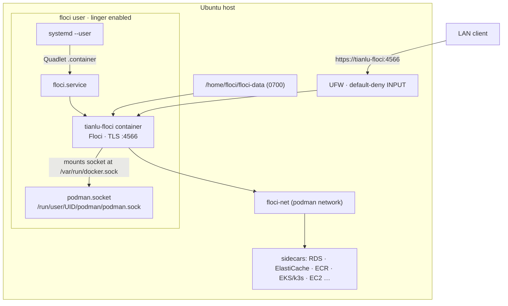

# Tianlu — Floci on Ubuntu Server with rootless Podman

Tianlu is an **idempotent bash installer** (`setup-floci.sh`) that deploys
[Floci](https://floci.io) — a local, self-hosted AWS emulator — onto an Ubuntu
Server using **rootless Podman**. Run it once to stand up a hardened Floci
service that survives reboots; re-run it any time to reconcile state.

The pinned image is `docker.io/floci/floci:1.5.33-compat`. The *compat* variant bundles
Python 3, the AWS CLI, and boto3, so the container can run initialization hooks
and client tooling without extra installs.

> This repository contains **infrastructure scripts and design documentation
> only** — there is no application code. Floci itself ships as a container image.

## Why rootless Podman

Floci runs as a dedicated, unprivileged `floci` user. If the Floci container or
any sidecar it spawns is compromised, the blast radius is confined to that
user's UID namespace — there is no path to host root. See
[`docs/design/solution-design.md`](docs/design/solution-design.md) §2 for the
full rationale.

## Architecture at a glance



- The container runs as a **systemd user service** managed by a **Quadlet**
  `.container` file (`~/.config/containers/systemd/floci.container`). Lingering
  (`loginctl enable-linger`) keeps it running across logouts and reboots.
- It mounts the **rootless Podman socket** so Floci can spawn sidecar containers
  (RDS, ElastiCache, ECR, EKS/k3s, EC2, …) through Podman's Docker-compatible
  API.
- All sidecars share a named network, **`floci-net`**, which provides container
  DNS and reachable IPs (the rootless default bridge does neither reliably).
- **TLS** is Floci's built-in self-signed certificate. **Storage** is
  persistent under `/home/floci/floci-data`.

Full design: [`docs/design/solution-design.md`](docs/design/solution-design.md).

## Prerequisites

- Ubuntu **24.04+** (tested on 26.04 LTS), x86_64
- Root or `sudo` for the setup phase (user creation, package install, firewall)

## Usage

```bash
# Non-interactive; opens the firewall to the server's auto-detected LAN /24
sudo ./setup-floci.sh

# Pause at each phase boundary for inspection (requires a TTY)
sudo ./setup-floci.sh --interactive

# Open the firewall to all RFC1918 ranges instead of the local /24
sudo ./setup-floci.sh --firewall-scope=rfc1918
```

The script runs seven phases: preflight → user setup → Podman setup →
network & image → Floci config → start & verify → summary. It is **idempotent**
— every step checks before it creates or modifies, so re-running is safe.

## Connecting clients

Point any AWS SDK or CLI at `https://tianlu-floci:4566`. Because the certificate
is self-signed, clients must disable TLS verification:

```bash
aws --endpoint-url https://tianlu-floci:4566 --no-verify-ssl s3 ls
```

```python
import boto3
s3 = boto3.client("s3", endpoint_url="https://tianlu-floci:4566", verify=False)
```

The installer adds `127.0.0.1 tianlu-floci` to `/etc/hosts` so host-side tooling
resolves the name without DNS. For **other machines on the LAN**, a future
`setup-dnsmasq.sh` stage maps `tianlu-floci` to the server's LAN IP
(see [`docs/design/dnsmasq-design.md`](docs/design/dnsmasq-design.md)); it is not
a prerequisite.

## Ports & services

| Port(s)   | Service               | Exposure                  |
| --------- | --------------------- | ------------------------- |
| 4566      | AWS API (all SDK/CLI) | firewall + container `-p` |
| 6379-6399 | ElastiCache           | firewall + container `-p` |
| 7001-7099 | RDS                   | firewall + container `-p` |
| 5100-5199 | ECR registry sidecar  | firewall (host-bound)     |
| 6500-6599 | EKS / k3s API server  | firewall (host-bound)     |
| 9400-9499 | OpenSearch data plane | firewall (host-bound)     |
| 2200-2299 | EC2 SSH               | firewall (host-bound)     |
| 9169      | EC2 IMDS              | firewall (host-bound)     |
| 9200-9299 | Lambda Runtime API    | internal only             |

"Host-bound" ports are opened in UFW but bound directly on the host by the
sidecar container, not via the Floci container's `-p` flags.

Do **not** open k3s *workload* ports (from `LoadBalancer`/`NodePort` services) in
UFW — UFW's default-deny INPUT policy is the primary control. Put a reverse proxy
with auth and TLS in front of anything that genuinely needs external access. See
[`docs/design/solution-design.md`](docs/design/solution-design.md) §10.

## Security posture — read before exposing

- **Unauthenticated by default.** `FLOCI_AUTH_VALIDATE_SIGNATURES=false` — any
  client with network access has full, unauthenticated control of every Floci
  resource. Deploy only on a **fully trusted, single-tenant LAN** (no guest
  WiFi, no untrusted VPN peers, no untrusted IoT on the same subnet).
- **Self-signed TLS provides encryption, not authentication.** A LAN host that
  can ARP-spoof can MITM the connection. Use certificates from a trusted CA if
  untrusted users share the network.
- **Access to the `floci` user is access to the Podman socket** — do not grant
  `sudo -u floci` to anyone you would not trust with full Floci control.

Details and mitigations: [`docs/design/solution-design.md`](docs/design/solution-design.md)
§11 and [`REVIEW.md`](REVIEW.md).

## Development & testing

```bash
brew install bats-core   # local dev dependency (shellcheck also required)
make lint                # shellcheck + bash -n
make test                # bats unit tests (command mocking via PATH stubs)
make check               # both
make twin-test            # build + drive the Lima digital twin (Apple Silicon, macOS 13+)
```

Podman/systemd/UFW behaviour is exercised two ways: the `tests/` bats suite
mocks those commands for fast unit feedback, and the **Lima digital twin**
(`mock-server/run-test.sh`) runs the installer end-to-end inside a headless
Ubuntu arm64 VM to validate the full control-plane behavior — systemd-logind,
rootless Podman, AppArmor enforcement, Quadlet generation, UFW rule
generation, and reboot autostart — before it touches the real x86_64 server.
The twin is an arm64 integration twin; architecture-specific Floci/sidecar
runtime behavior on x86_64 is out of scope for the twin and must be validated
on an x86_64 host. See
[`docs/design/digital-twin-testing-design.md`](docs/design/digital-twin-testing-design.md).

## Repository map

| Path | What it is |
| ------ | ------------ |
| `setup-floci.sh` | The installer (this project's core). |
| `README.md` | This file. |
| `AGENTS.md` | Conventions and gotchas for contributors/agents. |
| `REVIEW.md` | Design rationale and challenger-review findings. |
| `docs/design/solution-design.md` | Full solution architecture. |
| `docs/design/dnsmasq-design.md` | LAN-wide DNS design (future stage). |
| `docs/design/digital-twin-testing-design.md` | Digital-twin VM harness design. |
| `docs/design/digital-twin-testing-plan.md` | Digital-twin implementation plan. |
| `docs/design/gaps-register.md` | Open items requiring runtime testing. |
| `docs/scraped/INDEX.md` | Keyword map of scraped Floci documentation. |
| `mock-server/` | Lima digital-twin harness (twin definition, guest driver, host orchestrator, evidence). |

## Roadmap

- `setup-dnsmasq.sh` — LAN-wide DNS resolution for `tianlu-floci` → server IP.
