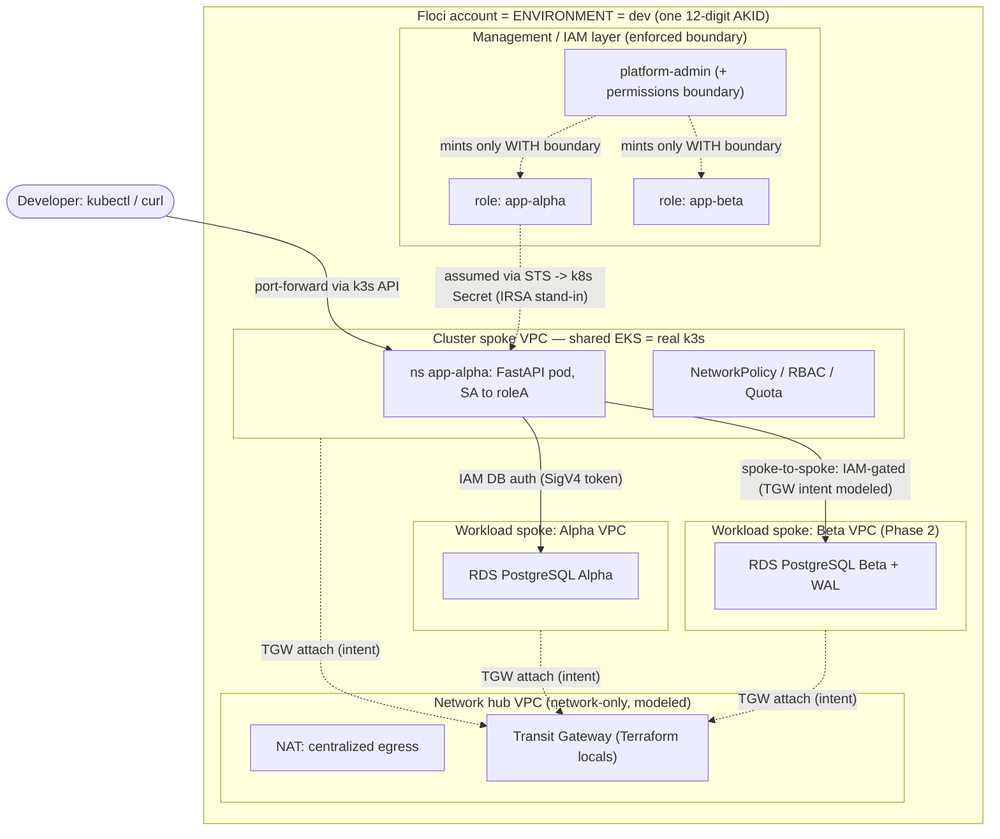
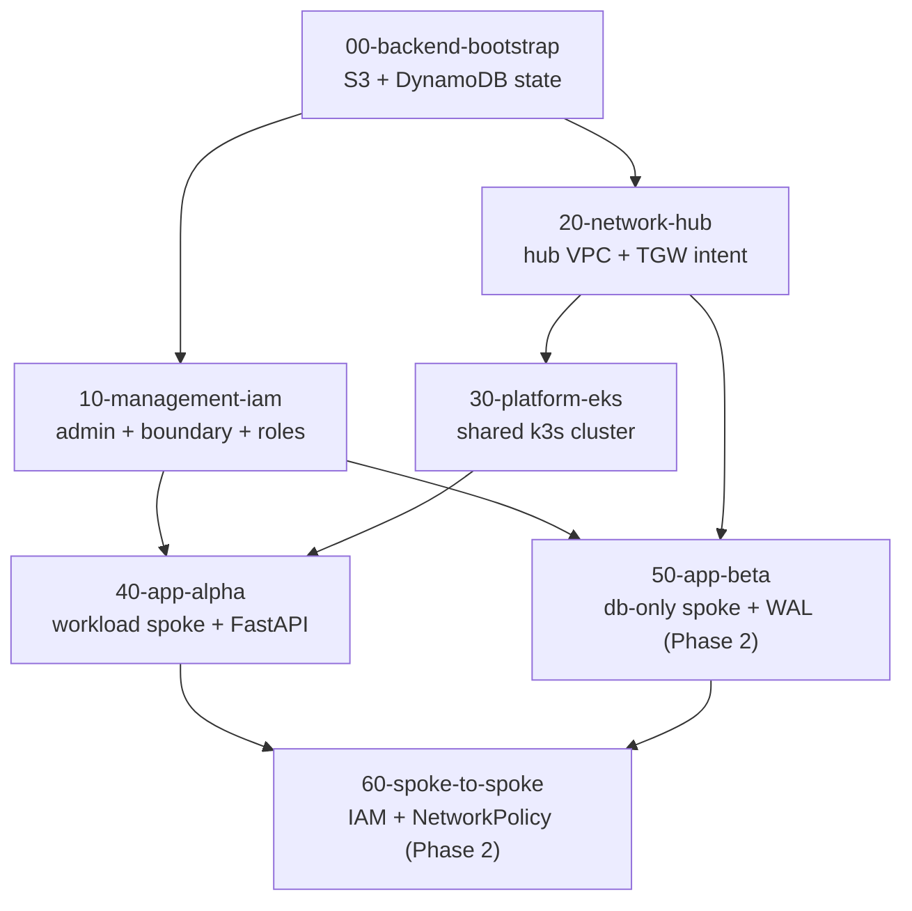

# Landing-Zone Design — AWS Estate on Floci (Terraform)

## 1. Overview

This document describes the architecture of an AWS-style **landing zone** provisioned entirely with
Terraform and running on **[Floci](https://floci.io/floci/)**, a local AWS emulator hosted on rootless
Podman (see [`solution-design.md`](solution-design.md) for the host platform). The estate delivers a
delegated IAM administration model, a hub-and-spoke network topology, a centralized Kubernetes
platform (EKS backed by real k3s), and per-application workload environments containing PostgreSQL
databases — all expressed as layered, independently-applied Terraform stacks.

The design targets four goals:

1. **Identity-first isolation** — each application is bounded by exactly one IAM role.
2. **Hub-and-spoke topology** — a network-only hub with workload and platform spokes.
3. **Centralized compute** — a single shared EKS cluster; applications run as namespaces.
4. **Environment-as-account** — the 12-digit AWS Access Key ID selects the environment (dev / uat /
   prod), so the same code promotes across environments unchanged.

### 1.1 Platform fidelity — enforced vs. modeled

Floci emulates the AWS **control plane** (the API that creates and describes resources) with high
fidelity, but only a subset of the **data plane** (the components that actually move packets or data).
The architecture is therefore explicit about which controls are *enforced* by the platform and which
are *modeled* (authored faithfully as Terraform but not enforced at runtime). This distinction drives
every security decision below.

| Concern | Mechanism | Status on Floci | Consequence for the design |
| --- | --- | --- | --- |
| API authorization | IAM / STS | **Enforced** (requires `FLOCI_AUTH_VALIDATE_SIGNATURES=true`) | IAM is the primary security boundary. |
| Kubernetes compute | EKS = real k3s | **Enforced** | Namespaces, RBAC, ResourceQuota, Pod Security Admission are real. |
| Pod-to-pod traffic | Kubernetes NetworkPolicy | **Enforced** (k3s CNI) | Network isolation *inside* the cluster is real. |
| Relational data | RDS = real PostgreSQL 16 | **Enforced** | Databases, WAL, and IAM DB authentication are real. |
| VPC / subnet / security group | EC2 network records | **Modeled** (records only) | Topology is authored but not a firewall; all containers share one bridge. |
| Transit Gateway / VPC peering | — | **Not implemented** | Modeled as Terraform `locals` (routing intent). |
| AWS Organizations / SCPs | — | **Not implemented** | Cross-account guardrails are documented, not enforced. |
| EKS OIDC provider (IRSA) | — | **Not implemented** | Pod identity uses a same-account STS stand-in. |

> **Design rule:** where Floci does not enforce a control, the intent is still authored in Terraform
> exactly as it would appear in real AWS, and the enforced equivalent (IAM and/or NetworkPolicy) is
> layered alongside it. Promotion to real AWS is then a matter of swapping the modeled resources for
> their native counterparts, with the application code unchanged.

## 2. Architecture



The estate is organized into four functional layers, each realized as one or more Terraform stacks:

- **Management / IAM layer** — a delegated `platform-admin` identity that provisions IAM users, roles,
  and policies. It can mint application roles only when a **permissions boundary** is attached,
  preventing privilege escalation by the delegated administrator.
- **Network hub** — a network-only VPC providing centralized egress (NAT) and public ingress, plus a
  Transit Gateway expressed as routing intent. The hub hosts no workloads.
- **Cluster spoke** — a single shared EKS (k3s) cluster in its own VPC. Applications are isolated as
  Kubernetes namespaces (soft multi-tenancy) reinforced with RBAC, ResourceQuota, Pod Security
  Admission, and default-deny NetworkPolicy.
- **Workload spokes** — one VPC per application, each containing the application's RDS PostgreSQL
  database and its dedicated IAM role. App-Alpha is a compute + database workload; App-Beta (Phase 2)
  is a database-only workload used to demonstrate spoke-to-spoke access.

## 3. Terraform directory structure

The estate uses **layered stacks**: each functional layer is an independent Terraform root module
("stage") with its own isolated remote state. Stages are applied in dependency order and consume each
other's outputs through `terraform_remote_state`. This keeps the blast radius of any single change
small and makes the promotion story trivial.

```text
infra/
├── README.md                      # operator quick-start
├── _common/                       # shared, copied-per-stage templates (see §3.1)
│   ├── versions.tf                # pinned Terraform core + provider versions
│   ├── providers.tf               # AWS provider aimed at the Floci endpoint
│   └── backend.hcl.example        # S3 remote-state backend configuration
├── environments/                  # one variable file per environment (= per account)
│   └── dev.tfvars                 # dev AKID + non-overlapping VPC CIDRs + tags
├── modules/
│   └── workload-spoke/            # reusable module that vends one application
│                                  #   (VPC + RDS + IAM role/boundary [+ namespace/SA/NetworkPolicy])
└── live/                          # ordered, independently-applied stages
    ├── 00-backend-bootstrap/      # S3 bucket + DynamoDB lock table (LOCAL state)
    ├── 10-management-iam/         # platform-admin, permissions boundary, application roles
    ├── 20-network-hub/            # network-only hub VPC + Transit Gateway routing intent
    ├── 30-platform-eks/           # shared EKS (k3s) cluster spoke
    ├── 40-app-alpha/              # App-Alpha workload spoke + namespace + FastAPI deployment
    ├── 50-app-beta/               # App-Beta database-only spoke (Phase 2)
    └── 60-spoke-to-spoke/         # Alpha -> Beta IAM grant + NetworkPolicy (Phase 2)

apps/
└── alpha-service/                 # FastAPI application source + Dockerfile (pushed to ECR)
```

### 3.1 Shared configuration (`_common/`)

Terraform requires provider and version blocks in **every** root module, so shared configuration
cannot live in an imported module. Instead, `_common/` holds canonical templates that are copied (or
symlinked) into each stage to keep pins and provider settings identical:

- **`versions.tf`** — pins Terraform `>= 1.9.0` and the `hashicorp/aws` (`>= 5.95, < 7.0`),
  `kubernetes`, `helm`, `random`, and `null` providers.
- **`providers.tf`** — configures the AWS provider to target Floci's single endpoint
  (`http://localhost:4566`) for every service, sets `access_key` to the account's AKID, applies
  mandatory `default_tags` (`Project`, `Environment`, `ManagedBy`), and enables the emulator
  conveniences (`skip_credentials_validation`, `skip_metadata_api_check`, `skip_region_validation`,
  `skip_requesting_account_id`, `s3_use_path_style`).
- **`backend.hcl.example`** — the S3 backend definition (bucket, DynamoDB lock table, Floci endpoints).
  The per-stage state `key` is supplied on the command line so the file stays generic.

### 3.2 Stage dependency graph



Stages must be applied in topological order. Changing an upstream stage's outputs requires re-planning
the downstream stages that consume them.

## 4. Environments and accounts

### 4.1 Environment = account = AKID

Floci isolates resources by **12-digit Access Key ID**: a given AKID selects a distinct account
namespace ([multi-account](https://floci.io/floci/configuration/multi-account/)). This estate maps the
AKID axis to **environments**:

| Environment | Account (AKID) | Status |
| --- | --- | --- |
| dev | `111111111111` | Built now |
| uat | `222222222222` | Future |
| prod | `333333333333` | Future |

Account isolation is automatic in Floci (multi-account is keyed on the AKID); there is no configuration
flag to enable it. AWS Organizations and Service Control Policies are **not** emulated, so
organization-level guardrails are documented rather than enforced.

### 4.2 Promotion model

Because environment identity is a single variable, promoting from dev to uat/prod requires no code
changes:

1. Copy `environments/dev.tfvars` to `environments/uat.tfvars`.
2. Change `account_id` to the new AKID (and adjust CIDRs if desired).
3. Change the backend state `key` prefix (e.g. `uat/<stage>/terraform.tfstate`).

The **same stage code applies unchanged**. Account IDs are always resolved at runtime via
`data.aws_caller_identity.current.account_id` and never hardcoded, so ARNs are correct in any account.
In real AWS this pattern generalizes to a *function × environment* account grid; the stacks are
parameterized so each stage could target a different account by swapping the provider AKID.

## 5. IAM and roles

Identity is the estate's primary, enforced security boundary. The IAM design implements delegated
administration with a hard escalation ceiling, and one bounded role per application.

### 5.1 Delegated administration — `platform-admin`

`platform-admin` is an assumable administrative identity (group + user + role) responsible for
managing IAM users, roles, and policies. To prevent a delegated administrator from escalating its own
privileges, its policy is **conditioned on the permissions boundary**: `iam:CreateRole`,
`iam:PutRolePolicy`, `iam:AttachRolePolicy`, and related actions are allowed only when the request
attaches the designated boundary policy (enforced via
`Condition { StringEquals { "iam:PermissionsBoundary": "<boundary ARN>" } }`). Any attempt to create a
role without the boundary is denied.

### 5.2 Permissions boundary

A managed policy defines the **maximum** permissions any application role may ever hold. It is attached
as the permissions boundary on every minted application role. Effective permissions are the
intersection of the role's identity policy and this boundary, so a mistaken or malicious grant cannot
exceed the ceiling.

### 5.3 One IAM role per application

Each application receives exactly one IAM role, which is both its identity and its blast-radius
boundary:

- **Least privilege** — the role's policy is scoped to that application's resources only (its RDS
  instance, its Glue database, etc.).
- **ABAC** — resources are tagged `App=<name>` and policies match on the tag, so adding a resource
  needs no policy edit. (On Floci, session tags are deployer-assigned rather than cryptographically
  bound to an OIDC token, so tag-based conditions are authored but their binding is not enforced.)
- **Bounded creation** — every application role is minted *with* the permissions boundary (§5.2).
- **Database access as an IAM permission** — the role is granted `rds-db:connect` and the application
  authenticates to PostgreSQL with a short-lived
  [SigV4 token](https://docs.aws.amazon.com/AmazonRDS/latest/UserGuide/UsingWithRDS.IAMDBAuth.html)
  rather than a static password.

### 5.4 Pod identity — IRSA stand-in

Real EKS delivers per-pod credentials through
[IRSA](https://docs.aws.amazon.com/eks/latest/userguide/iam-roles-for-service-accounts.html): a
projected ServiceAccount token is exchanged at STS via an OIDC provider for short-lived credentials.
Floci provides no OIDC provider, so this estate uses a **same-account stand-in**: the application's
ServiceAccount is annotated with the role ARN, and deploy-time `sts:AssumeRole` credentials are
injected into a Kubernetes Secret mounted by the pod.

> **Note:** the Secret-based approach is a Floci accommodation and a **production anti-pattern**
> (long-lived credential sprawl). In real EKS, IRSA or EKS Pod Identity must be used instead. The
> `sts:AssumeRole` mechanics demonstrated here transfer directly to the real flow; when Floci adds
> OIDC, the `workload-spoke` module migrates to native IRSA.

## 6. Networking

### 6.1 Hub-and-spoke topology

The network follows the AWS
[multi-VPC hub-and-spoke](https://docs.aws.amazon.com/whitepapers/latest/building-scalable-secure-multi-vpc-network-infrastructure/welcome.html)
pattern:

- **Hub VPC** — network-only: public ingress subnet, centralized NAT egress, and a Transit Gateway.
  No workloads run here.
- **Spoke VPCs** — the cluster spoke and each workload spoke attach to the hub. Egress and
  cross-spoke routing are centralized through the hub.

### 6.2 CIDR allocation

CIDRs are non-overlapping so the topology reads cleanly and would route correctly in real AWS. Region:
`eu-west-2`.

| VPC | CIDR | Role |
| --- | --- | --- |
| Hub | `10.0.0.0/16` | Network-only hub (TGW, centralized egress/ingress) |
| Cluster spoke | `10.10.0.0/16` | Shared EKS (k3s) cluster |
| App-Alpha spoke | `10.20.0.0/16` | App-Alpha workload (compute + database) |
| App-Beta spoke | `10.30.0.0/16` | App-Beta workload (database only, Phase 2) |
| (Floci default) | `172.31.0.0/16` | Seeded by Floci; left untouched |

### 6.3 Transit Gateway as routing intent

Floci's EC2 implements the standard VPC primitives (VPC, subnet, route table, internet gateway, NAT
gateway, security group, NACL, elastic IP) as records, but implements **neither Transit Gateway nor
VPC peering**. Creating `aws_ec2_transit_gateway*` or `aws_vpc_peering_connection` would fail at apply.

The hub therefore models the Transit Gateway — its attachments and route tables — as a declarative
Terraform **`locals`** structure ("routing intent"), with inline comments naming the exact real-AWS
resources to substitute during promotion. The supported VPC primitives are still created as records so
the `terraform-aws-modules/vpc` module applies and the topology is authored faithfully.

### 6.4 The three enforcement layers

A key architectural point is that connectivity, authorization, and pod traffic operate at different
layers and must not be conflated:

| Layer | Control | Enforced on Floci? | Purpose |
| --- | --- | --- | --- |
| L3 packet routing | Transit Gateway route tables | No (modeled in `locals`) | Which spoke can route to which |
| API authorization | IAM policies | **Yes** | Who may call RDS / EKS / Glue APIs |
| L4 pod traffic | Kubernetes NetworkPolicy | **Yes** (pod-to-pod) | Which pods may talk to which pods |

Because VPC/SG are not a data-plane firewall on Floci (all service containers share the bridged
`floci-net` network), the **enforced** network isolation is the Kubernetes NetworkPolicy applied inside
the k3s cluster. NetworkPolicy governs **pod-to-pod** traffic within the CNI; it does **not** govern a
pod reaching an external container such as the RDS sidecar. Database-access control is therefore
provided by **IAM DB authentication** (and host firewalling), not by NetworkPolicy.

## 7. Compute — centralized EKS (k3s)

The estate runs a **single shared EKS cluster** (backed by real k3s) in its own cluster spoke.
Applications are deployed as **namespaces** — soft multi-tenancy — because in Kubernetes the cluster is
the only construct that provides a strong security boundary. Each application namespace is reinforced
with:

- **RBAC** scoped to the namespace,
- **ResourceQuota** to cap resource consumption,
- **Pod Security Admission** to constrain pod capabilities,
- a **default-deny NetworkPolicy** with explicit allow rules.

The cluster is provisioned with the pinned
[`terraform-aws-modules/eks` v21.24.0](https://github.com/terraform-aws-modules/terraform-aws-eks/releases/tag/v21.24.0)
module. Because Floci's EKS is a single k3s container without the surrounding AWS integrations, the
module disables the sub-resources Floci cannot create:

- `enable_irsa = false` (no OIDC provider),
- `create_cloudwatch_log_group = false`, `cluster_enabled_log_types = []`,
- `create_kms_key = false` with an empty `cluster_encryption_config`,
- **no** managed or self-managed node groups (k3s is the node).

Cluster access is granted through the EKS
[Access Entries API](https://docs.aws.amazon.com/eks/latest/userguide/access-entries.html) where the
module supports it, in preference to the deprecated `aws-auth` ConfigMap.

> **Ingress note:** whether a `NodePort` or `LoadBalancer` Service is reachable from the host is
> unverified on Floci. Application access uses `kubectl port-forward` through the k3s API server (a
> reliable, host-exposed path). See §10.

## 8. Data — RDS PostgreSQL

Each workload spoke contains a real **RDS PostgreSQL 16** instance:

- **IAM database authentication** — applications connect with a SigV4 token (`rds-db:connect`) rather
  than a static password, tying database access to the application's IAM role (§5.3).
- **Write-ahead logging** — App-Beta enables WAL (and optionally logical replication) to demonstrate
  durability and change-data flows.
- **Tagging** — instances are tagged `App=<name>` to support the ABAC model.

### 8.1 Spoke-to-spoke access (Phase 2)

App-Alpha (a namespace in the shared cluster) reaches **App-Beta's** database in a different workload
spoke. In real AWS this traffic routes through the hub Transit Gateway and is gated by security groups
plus IAM. On Floci the enforced controls are:

1. a **Kubernetes NetworkPolicy** permitting egress from the `app-alpha` namespace toward Beta's
   database endpoint, and
2. a **cross-application IAM grant** — `role-alpha` is granted `rds-db:connect` on Beta's database,
   with the matching PostgreSQL `GRANT`.

The Transit Gateway path is recorded in the hub's routing-intent `locals`. Because environment =
account (§4), Alpha and Beta share the dev account, so no cross-account role chaining is required.
Removing **either** the IAM grant or the NetworkPolicy must break the connection — this is the
falsifiable verification of the spoke-to-spoke control.

## 9. State management

- **Backend** — every stage except the bootstrap uses an **S3 remote backend** on Floci, with a
  **DynamoDB lock table** for state locking.
- **Isolation** — state is isolated per `(environment, stage)` via the object key
  `<env>/<stage>/terraform.tfstate`, so stages have independent lifecycles and blast radius.
- **Bootstrap** — `00-backend-bootstrap` necessarily uses **local** state (it creates the very bucket
  and lock table the other stages depend on). It creates `tf-state-<env>` (versioning enabled) and
  `tf-locks-<env>`.
- **Locking** — Terraform's DynamoDB locking relies on conditional writes; this is verified by the
  pre-flight gate G3 (§10.1) before concurrent use. On Terraform ≥ 1.10, S3-native locking
  (`use_lockfile = true`) is an alternative.

## 10. Deployment

### 10.1 Prerequisites and pre-flight

- A running Floci at `http://localhost:4566` (see [`solution-design.md`](solution-design.md)).
- `terraform >= 1.9`, `aws` CLI v2, `kubectl`, `psql`, and `docker`/`podman`.
- **Pre-flight gates** — because several controls are only enforced under the right Floci
  configuration, run [`scripts/preflight-floci.sh`](../../scripts/preflight-floci.sh) before any
  `terraform apply`. It asserts:

  | Gate | Assertion |
  | --- | --- |
  | G1 | Signature authorization is ON (`FLOCI_AUTH_VALIDATE_SIGNATURES=true`) — a no-policy user is denied a privileged call. |
  | G2 | RDS IAM database authentication actually rejects a fake token. |
  | G3 | DynamoDB conditional writes work (Terraform state locking). |
  | G4 | k3s NetworkPolicy scope is pod-to-pod (verified on a live cluster). |
  | G5 | k3s admin token handling (verified on a live cluster). |

  G1 and G3 are automated and run without a cluster or database; G2/G4/G5 print the exact commands to
  run once a live RDS/k3s exists. If G1 fails, IAM is not enforced and the security model does not
  hold — this is a hard stop.

### 10.2 Apply order

Apply stages top-to-bottom (§3.2). The bootstrap stage uses local state:

```bash
cd infra/live/00-backend-bootstrap
terraform init
terraform apply -var-file=../../environments/dev.tfvars
```

Every subsequent stage initializes the shared S3 backend with a per-stage state key, then applies with
the environment variable file:

```bash
cd infra/live/20-network-hub
terraform init -backend-config=../../_common/backend.hcl \
               -backend-config="key=dev/20-network-hub/terraform.tfstate"
terraform apply -var-file=../../environments/dev.tfvars
```

### 10.3 Promotion

To build another environment, provide a new `environments/<env>.tfvars` (new AKID + CIDRs) and a new
backend `key` prefix; the stage code is unchanged (§4.2).

## 11. Accessing the application

Because host reachability of `NodePort`/`LoadBalancer` Services is unverified on Floci, application
access goes through the k3s API server via `kubectl port-forward`:

```bash
make pf-alpha                       # kubectl -n app-alpha port-forward svc/alpha 8080:80
curl -s localhost:8080/health       # liveness -> 200
curl -s localhost:8080/db           # PostgreSQL version via IAM DB auth
curl -s localhost:8080/peer-db      # Phase 2: reads App-Beta's DB (IAM + NetworkPolicy gated)
```

The application is a **FastAPI** service. Its container image is built from `apps/alpha-service/` and
pushed to Floci's ECR; the deployment runs in the `app-alpha` namespace with its ServiceAccount bound
to `role-alpha` (§5.4).

## 12. Security model summary

- **Primary boundary: IAM.** One bounded role per application; delegated administration cannot escalate
  past the permissions boundary; database access is an IAM permission.
- **Cluster boundary: namespaces + policy.** RBAC, ResourceQuota, Pod Security Admission, and
  default-deny NetworkPolicy provide soft multi-tenancy in the shared cluster.
- **Network intent: modeled.** VPC/subnet/SG/TGW are authored as they would be in real AWS but are not
  a data-plane firewall on Floci; the enforced network control is pod-to-pod NetworkPolicy.
- **Data access: IAM DB auth.** Applications authenticate to PostgreSQL with SigV4 tokens tied to their
  role, not static passwords.
- **Pre-flight gates** guarantee the platform actually enforces these controls before deployment.

## 13. Key design decisions

| # | Decision | Rationale |
| --- | --- | --- |
| 1 | One IAM role per application | Identity is the enforced boundary on Floci and the AWS-recommended primary boundary; gives least privilege and blast-radius containment. |
| 2 | Model hub-and-spoke (incl. TGW) as intent; enforce via IAM + NetworkPolicy | Floci implements neither TGW nor VPC peering and does not enforce SG; author the topology faithfully and enforce where the platform can. |
| 3 | Centralized EKS — one shared cluster; apps as namespaces | Matches the centralized EKS multi-tenancy pattern; keeps Floci to a single k3s container; isolation layered with RBAC/quota/PSA/NetworkPolicy. |
| 4 | Environment = account (AKID); layered stacks | Clean promotion story, small per-stage blast radius, and IaC-at-scale structure; account IDs resolved at runtime. |
| 5 | Spoke-to-spoke access is IAM-gated | The enforced controls are IAM + NetworkPolicy; the TGW route is recorded as intent; no cross-account chaining since env = account. |

## 14. Build roadmap

- **Phase 0 — foundations (complete):** pre-flight gates, `_common/` provider/version/backend
  templates, `environments/dev.tfvars`, solution diagram, `00-backend-bootstrap`.
- **Phase 1:** `10-management-iam` → `20-network-hub` → `30-platform-eks` → `workload-spoke` module →
  `40-app-alpha` + FastAPI service.
- **Phase 2:** `50-app-beta` (database-only spoke with WAL) → `60-spoke-to-spoke` (IAM grant +
  NetworkPolicy + `/peer-db` endpoint).

## 15. References

**IAM & identity** —
[IAM best practices](https://docs.aws.amazon.com/IAM/latest/UserGuide/best-practices.html) ·
[Well-Architected SEC03](https://docs.aws.amazon.com/wellarchitected/latest/security-pillar/sec-03.html) ·
[permissions boundaries](https://docs.aws.amazon.com/IAM/latest/UserGuide/access_policies_boundaries.html) ·
[ABAC](https://docs.aws.amazon.com/IAM/latest/UserGuide/introduction_attribute-based-access-control.html).
**Accounts & landing zones** —
[Well-Architected SEC01](https://docs.aws.amazon.com/wellarchitected/latest/security-pillar/aws-account-management-and-separation.html) ·
[Organizing your AWS environment](https://docs.aws.amazon.com/whitepapers/latest/organizing-your-aws-environment/organizing-your-aws-environment.html) ·
[SCPs](https://docs.aws.amazon.com/organizations/latest/userguide/orgs_manage_policies_scps.html).
**Networking** —
[multi-VPC infrastructure](https://docs.aws.amazon.com/whitepapers/latest/building-scalable-secure-multi-vpc-network-infrastructure/welcome.html) ·
[Transit Gateway](https://docs.aws.amazon.com/vpc/latest/tgw/how-transit-gateways-work.html) ·
[VPC + NAT](https://docs.aws.amazon.com/vpc/latest/userguide/vpc-example-private-subnets-nat.html).
**EKS** —
[multi-account strategy](https://docs.aws.amazon.com/eks/latest/best-practices/multi-account-strategy.html) ·
[tenant isolation](https://docs.aws.amazon.com/eks/latest/best-practices/tenant-isolation.html) ·
[IRSA](https://docs.aws.amazon.com/eks/latest/userguide/iam-roles-for-service-accounts.html) ·
[access entries](https://docs.aws.amazon.com/eks/latest/userguide/access-entries.html).
**Data** —
[RDS IAM DB auth](https://docs.aws.amazon.com/AmazonRDS/latest/UserGuide/UsingWithRDS.IAMDBAuth.html) ·
[PostgreSQL WAL](https://www.postgresql.org/docs/16/runtime-config-wal.html) ·
[logical replication](https://www.postgresql.org/docs/16/logical-replication.html).
**Kubernetes** —
[NetworkPolicy](https://kubernetes.io/docs/concepts/services-networking/network-policies/) ·
[Pod Security Admission](https://kubernetes.io/docs/concepts/security/pod-security-admission/) ·
[ResourceQuota](https://kubernetes.io/docs/concepts/policy/resource-quotas/) ·
[k3s networking](https://docs.k3s.io/networking/basic-network-options).
**Terraform** —
[S3 backend + locking](https://developer.hashicorp.com/terraform/language/settings/backends/s3) ·
[remote state](https://developer.hashicorp.com/terraform/language/state/remote-state-data) ·
[module versions](https://developer.hashicorp.com/terraform/language/modules/syntax#version) ·
modules [vpc](https://registry.terraform.io/modules/terraform-aws-modules/vpc/aws/latest) /
[eks 21.24.0](https://github.com/terraform-aws-modules/terraform-aws-eks/releases/tag/v21.24.0) /
[iam](https://registry.terraform.io/modules/terraform-aws-modules/iam/aws/latest).
**Floci** —
[services](https://floci.io/floci/services/) · [ec2](https://floci.io/floci/services/ec2/) ·
[eks](https://floci.io/floci/services/eks/) · [rds](https://floci.io/floci/services/rds/) ·
[multi-account](https://floci.io/floci/configuration/multi-account/).
