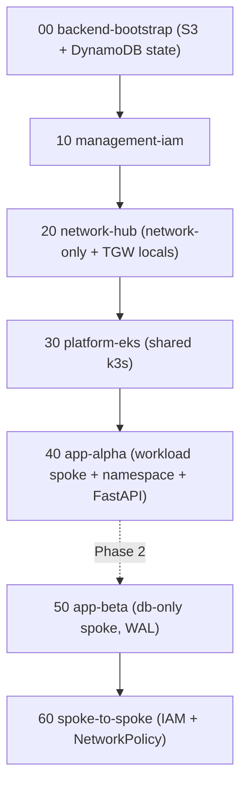

# Educational AWS landing zone on Floci

A heavily-commented Terraform estate that runs on **[Floci](https://floci.io/floci/)** (a local AWS
emulator on rootless Podman) to learn **AWS + networking + IaC-at-scale + landing zones** by building
one. Design rationale lives in [`docs/learning/`](../docs/learning/) (ADRs, findings, journal); the
picture is [`docs/learning/diagrams/solution.mmd`](../docs/learning/diagrams/solution.mmd).

> **The one idea to hold onto:** Floci does **not** enforce VPC networking, so the boundary we rely on
> is **IAM** (and Kubernetes **NetworkPolicy** for pod-to-pod). We still *author* a real hub-and-spoke
> landing zone — it just means the network pieces are **modeled** while IAM is **enforced**. Green =
> real/enforced; grey-dashed = metadata/modeled.

## Topology
- **Management/IAM layer** — a `platform-admin` that manages IAM users/roles/policies, minting app
  roles only *with a permissions boundary*.
- **Network hub** (network-only) — public ingress subnet, centralized NAT egress, and a **Transit
  Gateway modeled in Terraform `locals`** (Floci has no TGW — see Finding 0006).
- **Cluster spoke** — one shared **EKS = real k3s** cluster; apps run as **namespaces** (centralized,
  soft multi-tenancy).
- **Workload spokes** — one per app: its own VPC + **RDS Postgres** + IAM role. App-Alpha (compute +
  DB), App-Beta (DB only, with WAL — Phase 2).
- **Environment = account** — the 12-digit AKID is the environment; we build **dev** now.

## Prerequisites
- Podman + a running Floci at `http://localhost:4566` (the repo's `setup-floci.sh` / Lima dev-twin).
- `terraform >= 1.15.8` (the pin in [`_common/versions.tf`](_common/versions.tf)), `aws` CLI v2,
  `kubectl`, `psql`, `docker`/`podman`.
- **No credential exports needed.** `make dev-up` writes the account secret to
  `~/.cache/tianlu-floci/dev/account.secret`; [`stage.sh`](stage.sh) reads it and derives the AKID from
  `environments/<env>.tfvars`. Override with `export TF_VAR_secret_key=<secret>` if you are pointing at a
  Floci the dev twin did not create. Do **not** set `AWS_ACCESS_KEY_ID` or `AWS_PROFILE` — a mismatched
  AKID is refused, and an ambient profile is unset (both have already caused a wrong-account `init` here).
- **Run the pre-flight first** — it checks that Floci actually *enforces* what we teach:
  ```bash
  make -C infra preflight     # or directly: ./scripts/preflight-floci.sh
  ```
  It must confirm **G1** signature authorization is ON (`FLOCI_AUTH_VALIDATE_SIGNATURES=true`),
  **G2** RDS IAM auth rejects a fake token, **G3** DynamoDB conditional-write locking works. Without
  these, the IAM lessons are false demos (see `docs/learning/findings/`).

## Stage order (apply top-to-bottom; each reads the prior via remote state)

Apply a stage — `make` is the entry point (`make help` lists every target):
```bash
cd infra
make init  STAGE=20-network-hub          # syncs _common templates, wires the per-env backend
make plan  STAGE=20-network-hub
make apply STAGE=20-network-hub          # runs the G1/G3 pre-flight gate first
```
`ENV` defaults to `dev`; add `ENV=uat` for another account. `make plan-20-network-hub` is a shorthand.
Under the hood `make` calls [`stage.sh`](stage.sh), which is the only place terraform is invoked — it
derives `-backend-config=_common/backend-<env>.hcl`, the state key `<env>/<stage>/terraform.tfstate`,
and `-var-file=environments/<env>.tfvars`, and special-cases `00-backend-bootstrap` (local state). Note
`-backend-config` is an `init`-only flag; Terraform rejects it on `plan`/`apply`.

> **Endpoints:** `environments/dev.tfvars` uses `http://localhost:4566` while the dev twin's AWS CLI
> profile bakes in `http://tianlu-floci:4566`. Both reach the same Floci, but the hostname only resolves
> if you accepted the managed `/etc/hosts` entry during `make dev-up` (it is optional). Terraform always
> uses the tfvars value, so it works either way.

> **Blast radius:** changing an upstream stage's outputs requires re-planning downstream stages, so apply
> in topological order. `make plan-all` / `make apply-all` walk every stage in that order (`NN-` prefixes
> sort topologically), and `make lint-infra` runs `fmt -check` + `validate` across the estate with no
> credentials needed.

## How to access the application
NodePort/LoadBalancer host-reachability is unverified on Floci (Finding 0003), so use the k3s API:
```bash
make pf-alpha                       # kubectl -n app-alpha port-forward svc/alpha 8080:80
curl -s localhost:8080/health       # -> 200
curl -s localhost:8080/db           # -> Postgres version, via IAM DB auth
curl -s localhost:8080/peer-db      # Phase 2 -> reads App-Beta's DB (IAM + NetworkPolicy gated)
```

## Environment promotion (the IaC-at-scale lesson)
`dev` is one AKID. To add `uat`/`prod`: copy `environments/dev.tfvars`, change `account_id` (new AKID)
and the backend `key` prefix — **the same stage code applies unchanged** (account IDs come from
`data.aws_caller_identity`, never hardcoded). See
[ADR 0004](../docs/learning/decisions/0004-environment-as-account-layered-stacks.md).

## Glossary / learning primers
Each: *plain language · why it matters · Floci caveat.*

- **Control plane vs data plane** — the control plane creates/describes resources (the API records);
  the data plane actually moves packets/data. *Why:* Floci emulates most control planes but only some
  data planes. *Floci:* VPC/SG exist as records but move no packets; k3s/Postgres are real.
- **Metadata (in our diagrams)** — a resource that exists via the API but has no runtime effect in
  Floci. *Why:* you can `apply`/reference it, but it enforces nothing. *Floci:* VPC, subnet, SG, NAT,
  TGW.
- **Transit Gateway (TGW)** — a regional hub router connecting many VPCs (transitive, route-table
  controlled), unlike 1:1 non-transitive VPC peering. *Why:* the "hub" of hub-and-spoke.
  *Floci:* not implemented → modeled in Terraform `locals` (Finding 0006).
- **Hub-and-spoke** — a central network hub; workloads in spoke VPCs attach to it; egress/ingress
  centralized. *Floci:* modeled, not enforced.
- **VPC / subnet / security group** — the AWS network isolation primitives. *Floci:* metadata only
  (Finding 0001).
- **NAT / centralized egress** — one controlled internet exit for private subnets. *Floci:* a record;
  real egress is via the Podman bridge.
- **IAM boundary** — identity (roles/policies) as the access boundary. *Why:* the AWS-recommended
  primary boundary, and the one Floci enforces. *Floci:* enforced iff signatures are validated (G1).
- **ABAC** — attribute-based access control: policies match on tags (`App=<name>`) so access scales
  without policy edits. *Floci:* illustrative — session tags aren't OIDC-bound (Finding 0007).
- **Permissions boundary** — a max-permissions guardrail on a principal; delegated admins can only
  mint roles *with* it. *Why:* safe delegation.
- **IRSA stand-in** — real IRSA gives pods short-lived creds via OIDC; Floci has none, so we assume a
  role and inject creds into a Secret. *Caveat:* a production **anti-pattern** (Finding 0007).
- **Soft vs hard multi-tenancy** — soft = namespaces in one shared cluster (our model); hard = a
  cluster per tenant. *Why:* "the cluster is the only strong security boundary."
- **NetworkPolicy** — Kubernetes pod-to-pod traffic rules. *Floci:* enforced by k3s for pod-to-pod,
  **not** pod-to-RDS (Finding 0005).
- **AKID = environment** — a 12-digit Access Key ID selects the Floci account; we map it to
  dev/uat/prod. *Floci:* accounts isolate resources but Organizations/SCPs are absent (Finding 0004).

## References
IAM & identity — [best practices](https://docs.aws.amazon.com/IAM/latest/UserGuide/best-practices.html) ·
[WAF SEC03](https://docs.aws.amazon.com/wellarchitected/latest/security-pillar/sec-03.html) ·
[permissions boundaries](https://docs.aws.amazon.com/IAM/latest/UserGuide/access_policies_boundaries.html) ·
[ABAC](https://docs.aws.amazon.com/IAM/latest/UserGuide/introduction_attribute-based-access-control.html).
Accounts & landing zones — [WAF SEC01](https://docs.aws.amazon.com/wellarchitected/latest/security-pillar/aws-account-management-and-separation.html) ·
[Organizing your AWS environment](https://docs.aws.amazon.com/whitepapers/latest/organizing-your-aws-environment/organizing-your-aws-environment.html) ·
[SCPs](https://docs.aws.amazon.com/organizations/latest/userguide/orgs_manage_policies_scps.html).
Networking — [multi-VPC infra](https://docs.aws.amazon.com/whitepapers/latest/building-scalable-secure-multi-vpc-network-infrastructure/welcome.html) ·
[Transit Gateway](https://docs.aws.amazon.com/vpc/latest/tgw/how-transit-gateways-work.html) ·
[VPC + NAT](https://docs.aws.amazon.com/vpc/latest/userguide/vpc-example-private-subnets-nat.html).
EKS — [multi-account](https://docs.aws.amazon.com/eks/latest/best-practices/multi-account-strategy.html) ·
[tenant isolation](https://docs.aws.amazon.com/eks/latest/best-practices/tenant-isolation.html) ·
[IRSA](https://docs.aws.amazon.com/eks/latest/userguide/iam-roles-for-service-accounts.html) ·
[access entries](https://docs.aws.amazon.com/eks/latest/userguide/access-entries.html).
Data — [RDS IAM DB auth](https://docs.aws.amazon.com/AmazonRDS/latest/UserGuide/UsingWithRDS.IAMDBAuth.html) ·
[Postgres WAL](https://www.postgresql.org/docs/16/runtime-config-wal.html) ·
[logical replication](https://www.postgresql.org/docs/16/logical-replication.html).
Kubernetes — [NetworkPolicy](https://kubernetes.io/docs/concepts/services-networking/network-policies/) ·
[Pod Security Admission](https://kubernetes.io/docs/concepts/security/pod-security-admission/) ·
[ResourceQuota](https://kubernetes.io/docs/concepts/policy/resource-quotas/) ·
[k3s networking](https://docs.k3s.io/networking/basic-network-options).
Terraform — [S3 backend + locking](https://developer.hashicorp.com/terraform/language/settings/backends/s3) ·
[remote state](https://developer.hashicorp.com/terraform/language/state/remote-state-data) ·
[module versions](https://developer.hashicorp.com/terraform/language/modules/syntax#version) ·
modules [vpc](https://registry.terraform.io/modules/terraform-aws-modules/vpc/aws/latest) /
[eks 21.24.0](https://github.com/terraform-aws-modules/terraform-aws-eks/releases/tag/v21.24.0) /
[iam](https://registry.terraform.io/modules/terraform-aws-modules/iam/aws/latest).
Floci — [services](https://floci.io/floci/services/) · [ec2](https://floci.io/floci/services/ec2/) ·
[eks](https://floci.io/floci/services/eks/) · [rds](https://floci.io/floci/services/rds/) ·
[multi-account](https://floci.io/floci/configuration/multi-account/).

## Build status
- [x] Phase 0 foundations: pre-flight gates, `_common` provider/versions/backend, `environments/dev.tfvars`,
  learning docs (ADR 0001–0005, Finding 0001–0007, session, journal), solution diagram.
- [ ] Phase 1: `00-backend-bootstrap` → `10-management-iam` → `20-network-hub` → `30-platform-eks` →
  `workload-spoke` module → `40-app-alpha` + FastAPI.
- [ ] Phase 2: `50-app-beta` (WAL) + `60-spoke-to-spoke`.
